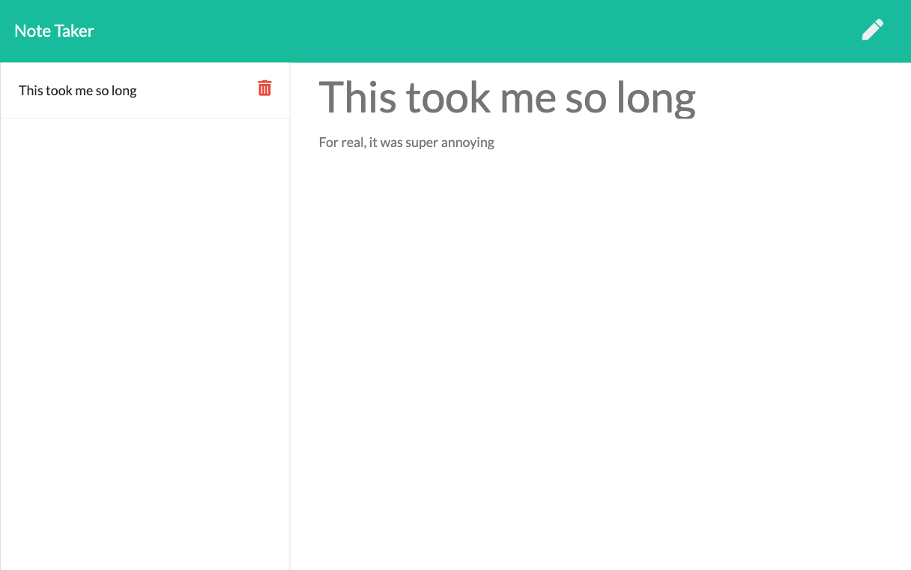

# JSON-note-taker

## Description

This is an application that can be used to write, save, and delete notes. This application uses an express backend and saves and retrieves note data from a JSON file.


## Table of Contents

* [Installation](#installation)
* [Usage](#usage)
* [License](#license)
* [Contributing](#contributing)
* [Tests](#tests)
* [Questions](#questions)


## Installation

### Setup


> install npm packages

```shell
$ npm install
```

### What it should look like



## Usage

Enter your title and note content and click the "save" icon. Click the "write" icon to write a new note, and click the "trashcan" icon to delete notes.


## License

This project is under the MIT license. For full license information, please [click here](https://choosealicense.com/licenses/MIT/). 


## Contributing

> To get started...

### Step 1

- **Option 1**
    - 🍴 Fork this repo!

- **Option 2**
    - 👯 Clone this repo to your local machine using `https://github.com/a-mccaffrey/JSON-note-taker.git`

### Step 2

- **HACK AWAY!** 🔨🔨🔨

### Step 3

- 🔃 Create a new pull request using <a href="https://github.com/a-mccaffrey/JSON-note-taker/compare/" target="_blank">`https://github.com/a-mccaffrey/JSON-note-taker/compare/`</a>.

## Tests

I did not write any tests for this project. You are welcome to write your own for practice.


## Questions

Want to know more? Look me up on GitHub. My username is a-mccaffrey and my profile is [here](https://www.github.com/a-mccaffrey)

Alternatively, get in touch by emailing me at [aisling.s.mccaffrey@gmail.com](mailto:aisling.s.mccaffrey@gmail.com).
